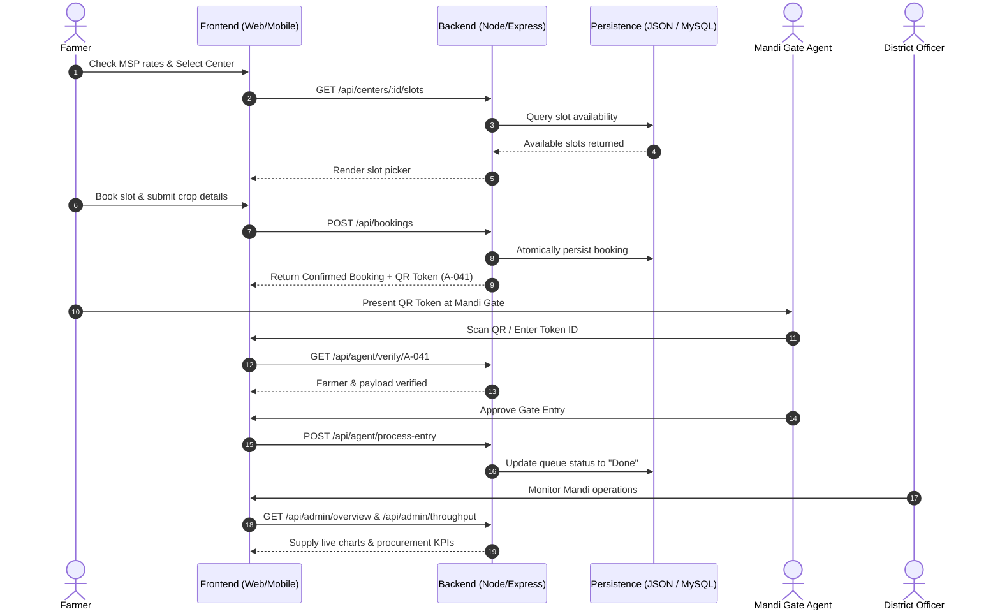

# 🌾 AgriQueue+

> **Next-Generation Smart Agricultural Queue Management & Transparent MSP Procurement Platform**

[](https://nodejs.org/)
[](https://expressjs.com/)
[](https://www.mysql.com/)
[](https://developer.mozilla.org/)
[](#license)

---

## 📌 Overview

**AgriQueue+** is an end-to-end digital logistics and queue orchestration ecosystem engineered for agricultural mandi procurement. It modernizes government Minimum Support Price (MSP) grain procurement by eliminating chaotic physical queues, ensuring transparent crop valuation, providing real-time crowd intelligence, and accelerating gate clearance through cryptographic QR entry tokens.

Whether accessing from a rural smartphone or an administrative command center, AgriQueue+ delivers a high-speed, dual-mode experience backed by a resilient Node.js REST API with offline local storage fallbacks.

---

## 🚀 Key Features

### 🌾 1. Farmer Portal
- **Live MSP Rates & Market Trends**: Daily price tickers tracking rate fluctuations across major crops (Wheat, Paddy, Mustard, Cotton, Gram, etc.).
- **Smart Crop Valuation Calculator**: Instant revenue estimations based on crop type, acreage, and expected yield.
- **Congestion-Aware Center Selection**: Nearby procurement center discovery displaying real-time distance, capacity, and crowd levels (`Low`, `Medium`, `High`).
- **4-Step Slot Booking Wizard**: Effortless booking with crop selection, center assignment, time slot scheduling, and vehicle registration.
- **Digital QR Entry Tokens**: Tamper-proof, scannable QR tokens (e.g., `A-041`) containing encrypted driver and harvest payloads.
- **PFMS Payment Milestone Tracker**: 4-phase tracking from gate clearance and moisture grading to direct bank disbursement.
- **Grievance Redressal Desk**: Lodge disputes regarding weighing inaccuracies or payment delays with real-time resolution updates.

### ⚖️ 2. Center Weighing & Gate Agent Portal
- **Gate Arrival Queue**: Live-updating queue categorizing trucks into `Done`, `Current`, and `Pending`.
- **Instant QR Code Scanner & Token Lookup**: Fast token validation using automated QR scanner payloads or manual token search.
- **Truck Gate Entry Clearance**: Verify moisture percentage, crop type, and declared weight before authorizing entry to weighbridge scales.
- **Queue Throughput Optimization**: Minimize turnaround times and eliminate physical traffic bottlenecks outside mandi gates.

### 🏛️ 3. Admin & District Officer Portal
- **Executive Command Center**: High-level KPIs tracking registered farmers, active tokens, daily tonnage procured, and total MSP disbursed.
- **Real-Time Throughput Analytics**: Interactive charts visualizing hourly arrivals, center-wise processing volume, and peak load distributions.
- **Procurement Distribution by Crop**: Granular financial breakdowns of commodity volumes and state payouts.
- **Live Grievance Resolution**: Review, inspect, and mark farmer complaints as resolved with instant audit timestamps.

---

## 🏗️ System Architecture & Workflow



---

## 📁 Repository Structure

```
AgriQueue+/
├── backend/                      # Node.js & Express REST API Server
│   ├── .env                      # Environment configuration (Port, DB credentials)
│   ├── package.json              # Backend dependencies & lifecycle scripts
│   ├── server.js                 # Server bootstrap, middleware & route mounter (Port 5000)
│   ├── schema.sql                # Complete MySQL DDL schema and initial seed data
│   │
│   ├── config/
│   │   ├── db.js                 # Atomic JSON persistence adapter (Zero-config mode)
│   │   ├── mysqlDb.js            # MySQL2 connection pool & parameterized query runner
│   │   └── initDatabase.js       # Automated database creation & schema migration script
│   │
│   ├── controllers/
│   │   ├── adminController.js    # Executive KPIs, hourly throughput & financial summaries
│   │   ├── agentController.js    # Gate scanner lookup, entry approvals & rejections
│   │   ├── authController.js     # User registration, phone OTP dispatch & validation
│   │   ├── bookingController.js  # Slot reservations, QR tokens & PFMS milestones
│   │   ├── centerController.js   # Procurement hubs, capacity & time-slot availability
│   │   ├── complaintController.js# Grievance registration & administrative resolution
│   │   └── mspController.js      # MSP rates table & harvest valuation calculations
│   │
│   ├── data/
│   │   └── database.json         # Out-of-the-box persistent local JSON database
│   │
│   └── routes/
│       ├── adminRoutes.js        # /api/admin/*
│       ├── agentRoutes.js        # /api/agent/*
│       ├── authRoutes.js         # /api/auth/*
│       ├── bookingRoutes.js      # /api/bookings/*
│       ├── centerRoutes.js       # /api/centers/*
│       ├── complaintRoutes.js    # /api/complaints/*
│       └── mspRoutes.js          # /api/msp/*
│
├── frontend/                     # Modular Web Application
│   ├── index.html                # Single-page shell with tabbed role navigation
│   │
│   ├── css/
│   │   ├── main.css              # Design tokens, color system, typography & animations
│   │   ├── components.css        # Buttons, cards, form inputs, badges & navigation bars
│   │   ├── landing-auth.css      # Hero presentation, role selection & OTP modals
│   │   ├── farmer.css            # Booking wizard, crowd indicators, token modal & PFMS
│   │   └── admin.css             # Admin dashboard analytics & agent scanner views
│   │
│   └── js/
│       ├── api.js                # API client with automatic offline fallback & sync
│       ├── app.js                # Application bootstrapper and route dispatcher
│       ├── auth.js               # Authentication state, session handling & simulated OTP
│       ├── data.js               # Static defaults, MSP catalog & fallback data
│       ├── farmer.js             # Farmer workflows, booking wizard & grievance UI
│       ├── agent.js              # Gate agent scanner, token lookup & clearance logic
│       ├── admin.js              # Admin KPIs, Chart.js integrations & dispute resolution
│       ├── state.js              # Central reactive state & localStorage synchronizer
│       └── utils.js              # Toast notifications, modal handlers & formatters
│
├── README.md                     # Comprehensive project documentation
└── .gitignore                    # Version control ignore definitions
```

---

## 🛠️ Tech Stack

| Domain | Technology | Description |
| :--- | :--- | :--- |
| **Backend Runtime** | [Node.js](https://nodejs.org/) (v16+) | High-throughput asynchronous JavaScript runtime |
| **Web Framework** | [Express 5.x](https://expressjs.com/) | Lightweight REST API routing and middleware pipeline |
| **Default Storage** | **Atomic JSON DB** | Zero-setup persistent JSON database (`backend/data/database.json`) |
| **Enterprise DB** | [MySQL 8.x](https://www.mysql.com/) / `mysql2` | Production-grade relational schema with connection pooling |
| **Frontend Core** | HTML5, CSS3, Vanilla ES6+ | Lightweight, fast-loading, framework-free architecture |
| **Data Visualization**| [Chart.js](https://www.chartjs.org/) | Dynamic throughput & commodity distribution charts |
| **QR Engine** | [QRCode.js](https://github.com/davidshimjs/qrcodejs) | Client-side dynamic QR generation for entry tokens |

---

## ⚡ Getting Started

### Prerequisites
- **Node.js** (v16.0.0 or higher recommended)
- **npm** (comes packaged with Node.js)
- A modern web browser (Google Chrome, Microsoft Edge, Mozilla Firefox, or Safari)
- *(Optional)* **MySQL Server** (if utilizing the relational database backend)

---

### 1. Backend Setup

1. Open your terminal and change into the `backend` directory:
   ```bash
   cd backend
   ```

2. Install the necessary dependencies:
   ```bash
   npm install
   ```

3. Configure environment variables (optional for default setup):
   - The `.env` file is pre-configured for local execution:
     ```env
     PORT=5000
     DB_HOST=localhost
     DB_USER=root
     DB_PASSWORD=root
     DB_NAME=agriqueue_plus
     DB_PORT=3306
     ```

4. *(Optional)* Set up MySQL:
   If you wish to use MySQL instead of the default atomic JSON database:
   ```bash
   npm run db:init
   ```
   *This executes `schema.sql` to generate tables and load seed records.*

5. Start the backend server:
   ```bash
   npm start
   ```
   *The server boots at `http://localhost:5000`.*

---

### 2. Frontend Setup

The frontend is completely modular and requires no build steps:

1. Navigate to the `frontend/` directory.
2. Open `index.html` directly in your browser:
   - Double-click `frontend/index.html`, **or**
   - Use a lightweight local server for the best experience:
     ```bash
     npx serve frontend
     ```
     or using Python:
     ```bash
     python -m http.server 8080 --directory frontend
     ```
3. The frontend connects to `http://localhost:5000/api` automatically. If the backend is stopped or unavailable, the application gracefully continues in **Offline Mode** using local browser storage!

---

## 🔑 Demo & Test Accounts

You can test any role directly using the role switcher on the login screen, or with the pre-seeded credentials below:

| Role | Phone Number | Name / Description | Test Verification Token |
| :--- | :--- | :--- | :--- |
| **🌾 Farmer** | `+91 98765 43210` | Ramesh Kumar | `A-041` (Balwinder Kumar, Wheat) |
| **🏛️ Admin / Officer** | `+91 99999 88888` | District Procurement Officer | Access full mandi analytics |
| **⚖️ Mandi Gate Agent**| `+91 77777 66666` | Center Weighing Agent | Test scan with `A-041` |

> **OTP Note:** During testing and local development, the system auto-fills or accepts simulated 4-digit OTPs (default: `1234` or any 4 digits).

---

## 📡 REST API Reference

All endpoints are prefixed with `/api`.

### 🔐 Authentication (`/api/auth`)
| Method | Endpoint | Description |
| :--- | :--- | :--- |
| `POST` | `/api/auth/send-otp` | Generate and dispatch verification OTP |
| `POST` | `/api/auth/login` | Verify phone number and OTP code |
| `POST` | `/api/auth/register` | Register a new farmer or officer profile |

### 🌾 MSP & Crop Rates (`/api/msp`)
| Method | Endpoint | Description |
| :--- | :--- | :--- |
| `GET` | `/api/msp` | Retrieve full list of official crop MSP prices and daily changes |
| `GET` | `/api/msp/calculate?crop=Wheat&acres=5&yield=15` | Calculate expected total yield and gross payout |

### 🏢 Centers & Time Slots (`/api/centers`)
| Method | Endpoint | Description |
| :--- | :--- | :--- |
| `GET` | `/api/centers` | Fetch all procurement centers with distance & live congestion level |
| `GET` | `/api/centers/:id/slots` | Fetch all hourly time slots and real-time availability for a center |

### 🎫 Bookings & Tokens (`/api/bookings`)
| Method | Endpoint | Description |
| :--- | :--- | :--- |
| `GET` | `/api/bookings` | List active bookings (supports `?phone=` filter) |
| `POST` | `/api/bookings` | Create new slot booking and generate cryptographic QR token |
| `GET` | `/api/bookings/:id/tracker` | Retrieve 4-stage PFMS payment lifecycle tracking |

### ⚖️ Gate Agent Operations (`/api/agent`)
| Method | Endpoint | Description |
| :--- | :--- | :--- |
| `GET` | `/api/agent/queue` | Retrieve today's gate arrival queue and statuses |
| `GET` | `/api/agent/verify/:token` | Lookup farmer booking details by token string (e.g. `A-041`) |
| `POST` | `/api/agent/process-entry` | Approve truck entry to weighbridge scales |
| `POST` | `/api/agent/reject-entry` | Reject gate clearance with reason logging |

### 📢 Grievances & Complaints (`/api/complaints`)
| Method | Endpoint | Description |
| :--- | :--- | :--- |
| `GET` | `/api/complaints` | Fetch grievance list (supports `?phone=` filter) |
| `POST` | `/api/complaints` | Submit a new grievance report |
| `PATCH`| `/api/complaints/:id/resolve` | Mark complaint as resolved with timestamp |

### 📊 Administration & Analytics (`/api/admin`)
| Method | Endpoint | Description |
| :--- | :--- | :--- |
| `GET` | `/api/admin/overview` | Executive statistics (Farmers, active tokens, tons, payout) |
| `GET` | `/api/admin/throughput` | Hourly queue arrival and clearance chart metrics |
| `GET` | `/api/admin/crop-stats` | Volume breakdown and budget distribution per commodity |

---

## 🛡️ Fault Tolerance & Offline Support

AgriQueue+ is built to function reliably even in rural areas with intermittent connectivity:
- **Dual-Mode API Layer** ([`frontend/js/api.js`](frontend/js/api.js)): Detects backend health automatically. If an API call fails or times out, the client seamlessly falls back to browser `localStorage` without interrupting user workflow.
- **Atomic File Writing** ([`backend/config/db.js`](backend/config/db.js)): The JSON database performs atomic writes, preventing data corruption during concurrent booking updates.
- **Zero-Dependency Database Start**: You can run the entire system instantly without installing or configuring MySQL.

---

## 📄 License

Proprietary — Developed for the **AgriQueue+** Smart Agriculture Initiative © 2026. All rights reserved.
